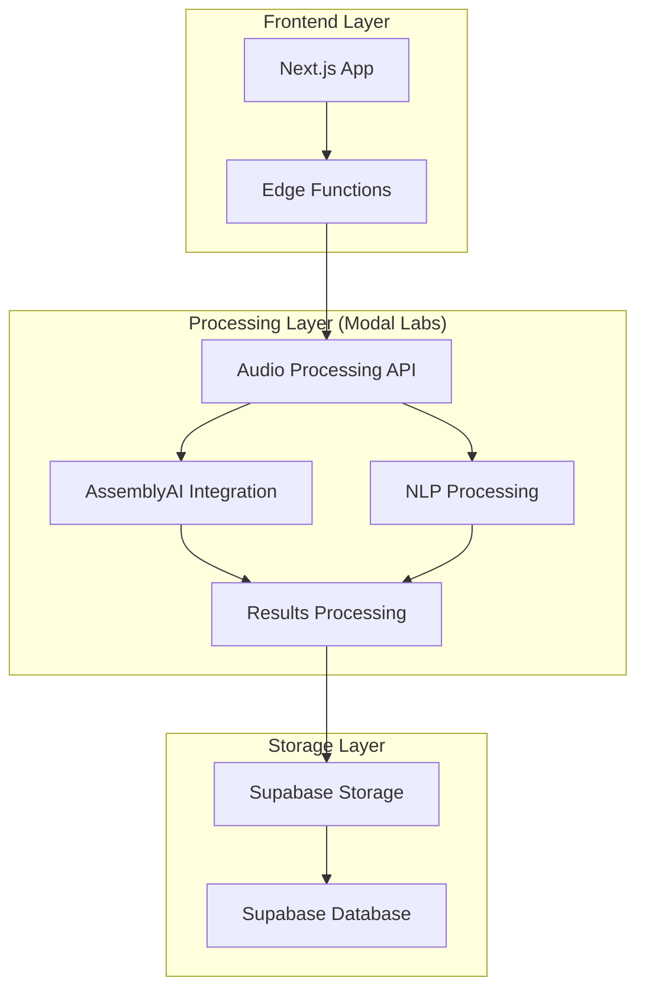
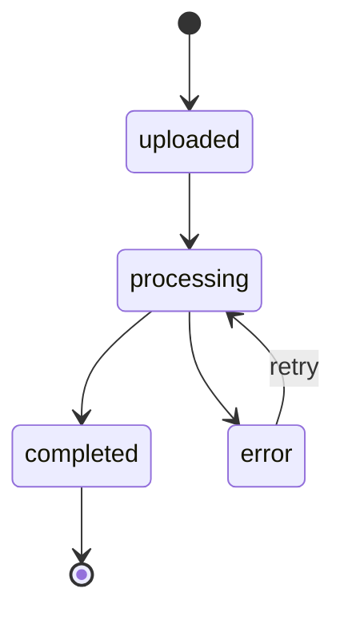

# System Patterns: Meeting Analyzer

## System Architecture
Meeting Analyzer follows a modern web application architecture with:

1. **Frontend Layer:**
   - Next.js (App Router)
   - React components with TypeScript
   - Tailwind CSS for styling
   - Shadcn/UI component library

2. **Backend Services:**
   - Supabase for authentication, database, and storage
   - PostgreSQL database with row-level security
   - Vercel Edge Functions for lightweight processing
   - ModalLabs Serverless for compute-intensive tasks
   - Provider-based transcription services
   - API routes for backend operations

3. **Processing Architecture:**
   ```
   User → Frontend → Edge Functions (Light Processing) → 
   ModalLabs (Heavy Processing) → Database/Storage → Frontend Display
   ```

4. **Edge Functions Layer:**
   - Real-time data processing
   - Authentication and authorization
   - Simple data transformations
   - API route handlers
   - Caching and rate limiting
   - Lightweight data aggregation
   - Webhook handlers
   - Basic NLP tasks

5. **ModalLabs Serverless Layer:**
   - Complex transcription processing
   - Advanced NLP tasks
   - Large file processing
   - ML model inference
   - Batch processing
   - GPU-accelerated tasks
   - Memory-intensive operations
   - Custom model training

6. **Internationalization Layer:**
   - Translation files organized by locale
   - Language detection and switching
   - Locale-specific formatting for dates and numbers
   - RTL support for UI components

## Key Technical Decisions

### Next.js App Router
- Provides server-side rendering capabilities
- Enables API routes and server components
- Simplifies routing and navigation
- Supports internationalized routing

### Supabase Integration
- Handles authentication and user management
- Provides secure database with row-level security
- Offers storage buckets for media files
- Enables real-time updates if needed

### Provider/Adapter Pattern
- Abstract interfaces for service integration
- Pluggable transcription providers (AssemblyAI, Whisper, Google Speech-to-Text)
- Swappable NLP processing engines
- Interchangeable visualization strategies
- Extensible integration points for CRMs and calendar systems

### Speech Recognition Adapters
- Default adapter for AssemblyAI
- Alternative adapters for Whisper, Google Speech-to-Text
- Support for on-premise models
- Consistent API for transcription and diarization
- Provider-specific feature extensions

### Modal Labs Integration
- Handles specialized high-load processing tasks
- Offloads computation-intensive operations
- Provides scalable backend processing

### Visualization System
- Dynamic relationship mapping between topics
- NLP-based weight calculation for topic importance
- Interactive node-based visualization
- Cross-meeting topic analysis

### Third-Party Integrations
- CRM adapters (Salesforce, Hubspot) for pipeline insights
- Calendar integration (Google Calendar, Outlook) for meeting management
- Meeting platform connectors (Zoom, Meet, Teams) for automatic recording ingestion

### Internationalization Strategy
- Translation files for UI text
- Locale-aware component rendering
- RTL layout support
- Date and number formatting by locale
- Language selection persistence
- Dynamic loading of language resources

## Design Patterns

### Provider/Adapter Pattern
- Abstract provider interfaces
- Concrete provider implementations
- Feature detection and capability management
- Configuration-based provider selection

### Theme-based Organization
- Insight-first structure over meeting-centric view
- Cross-cutting topic tracking across meetings
- Timeline-based theme evolution visualization

### Authentication Pattern
- Email/password and OAuth providers
- Protected routes and API endpoints
- MFA support for enhanced security

### Data Access Pattern
- Row-level security policies to ensure users only access their data
- Service roles for backend operations
- Storage policies for secure file handling

### UI Component Pattern
- Reusable UI components using Shadcn/UI
- Consistent styling with Tailwind CSS
- Responsive design for all device sizes
- Internationalized components with translation support

### State Management
- Server and client components for efficient rendering
- Local state for UI interactions
- Database state for persistent storage
- Locale state for internationalization

### Internationalization Pattern
- Translation key approach with namespaces
- Component-level translations
- Server and client translation support
- Locale detection and preference storage
- Fallback language handling

## Component Relationships

### Core Components:
1. **Authentication Components**
   - Login/Signup forms
   - Authentication providers
   - Protected routes

2. **Meeting Management Components**
   - Automatic and manual upload interfaces
   - Meeting list/grid with insight highlighting
   - Meeting details view
   - Collection organization
   - Calendar integration

3. **Meeting Interface Components**
   - Tab navigation system
   - Overview tab with dynamic relationship visualization
   - Transcript tab with diarized transcript display
   - Comments tab with threaded comments
   - Assistant tab with chat interface
   - Pre-meeting context panel

4. **Playback Components**
   - Audio/video player with transcript synchronization
   - Playback controls
   - Timestamp navigation
   - Emotion/sentiment indicators

5. **Analysis Components**
   - Dynamic topic relationship visualizer
   - Meeting theme explorer
   - Speaker metrics visualization
   - Emotion and sentiment analysis
   - Team performance dashboard
   - CRM opportunity connector

6. **Marketing Components**
   - Landing page with value propositions
   - Authentication pages with benefits messaging
   - Testimonial displays
   - Feature highlights
   - Pricing component

7. **Internationalization Components**
   - Language selector
   - Locale-aware formatters
   - Translation providers
   - RTL layout components

### Data Model:
- Users
- Meetings
- Collections (groups of related meetings)
- Themes (cross-cutting topics across meetings)
- Transcriptions
- Speakers
- Comments
- Analysis results
- Integration connections (CRM, Calendar)
- Team performance metrics
- User preferences (including language settings)

## Implementation Progress:

### Completed Components:
- Landing page with core value propositions
- Authentication pages with marketing copy
- Relationship graph visualization concept
- 4-tab interface presentation
- Portuguese localization for key pages

### In Progress Components:
- Main application dashboard
- Meeting details view with 4-tab interface
- Relationship visualization implementation
- Provider interfaces and adapters
- Integration connectors

## Modal Labs Integration Pattern

### Architecture Overview


### Integration Strategy
1. **Development Phase**
   - Modal functions are developed and deployed independently
   - Each function is exposed as an HTTP endpoint
   - URLs are generated and stored in environment variables

2. **Runtime Phase**
   - Edge Functions act as intermediaries
   - All Modal interaction happens via HTTP
   - No direct Modal SDK usage in production

3. **Data Flow**
   - Frontend uploads to Supabase Storage
   - Edge Function calls Modal endpoint with file URL
   - Modal processes and stores results
   - Frontend polls for completion

### Key Patterns

1. **Provider Pattern**
```typescript
// providers/modal.ts
export class ModalProvider {
    private endpoints: {
        processAudio: string;
        processText: string;
    };
    
    constructor(endpoints: ModalEndpoints) {
        this.endpoints = endpoints;
    }
    
    async processAudio(url: string): Promise<string> {
        // Implementation
    }
    
    async processText(text: string): Promise<AnalysisResult> {
        // Implementation
    }
}
```

2. **Edge Function Pattern**
```typescript
// app/api/process-meeting/route.ts
import { ModalProvider } from '@/providers/modal';

export async function POST(request: Request) {
    const provider = new ModalProvider({
        processAudio: process.env.MODAL_PROCESS_AUDIO_URL,
        processText: process.env.MODAL_PROCESS_TEXT_URL
    });
    
    // Implementation
}
```

3. **Modal Function Pattern**
```python
# modal_functions/api.py
@stub.function(gpu="A10G")
@modal.fastapi_endpoint(method="POST")
def process_audio(request_data: AudioRequest):
    # Implementation
    return {"status": "processing"}
```

### Security Considerations
1. **Authentication**
   - Modal endpoints secured with tokens
   - Tokens stored in environment variables
   - No sensitive data in client code

2. **Data Access**
   - Modal functions access storage directly
   - Results stored in secure database
   - Client receives only necessary data

### Monitoring & Scaling
1. **Health Checks**
   - Regular endpoint monitoring
   - Performance metrics collection
   - Error rate tracking

2. **Auto-scaling**
   - Modal handles container scaling
   - Resource limits per function
   - Cost optimization built-in 

## Data Models

### Enhanced Transcription System with Search Optimization
```typescript
// Core Tables
meetings {
  id: string
  name: string
  audio_url: string | null
  transcription_id: string | null
  transcription_status: 'uploaded' | 'processing' | 'completed' | 'error'
  transcription_language: string | null
  transcription_error: string | null
  transcription_config: {
    punctuate: boolean
    format_text: boolean
    speaker_labels: boolean
    auto_chapters: boolean
    entity_detection: boolean
    iab_categories: boolean
    sentiment_analysis: boolean
    auto_highlights: boolean
  } | null
  duration: number // Total duration in seconds
  total_speakers: number
  main_topics: string[] // Array of primary topics for quick filtering
  user_id: string
  created_at: string
  updated_at: string
}

transcription_segments {
  id: string
  meeting_id: string
  start: number
  end: number
  text: string
  speaker: string | null
  confidence: number
  text_vector: vector // For semantic search
  sentiment_score: number // Normalized sentiment score
  is_question: boolean // Whether this segment contains a question
  is_action_item: boolean // Whether this segment contains an action item
  speaker_sequence: number // Order of speaker appearance
  created_at: string
}

transcription_words {
  id: string
  meeting_id: string
  segment_id: string
  text: string
  start: number
  end: number
  confidence: number
  speaker: string | null
  text_vector: vector // For word-level semantic search
  created_at: string
}

transcription_speakers {
  id: string
  meeting_id: string
  speaker: string
  total_time: number
  segments_count: number
  words_count: number
  average_confidence: number
  interruption_count: number // Number of times interrupted
  question_count: number // Number of questions asked
  sentiment_distribution: {
    positive: number
    negative: number
    neutral: number
  }
  top_topics: string[] // Most discussed topics by this speaker
  interaction_matrix: { // Who they interact with most
    [speaker: string]: number
  }
  created_at: string
}

transcription_interactions {
  id: string
  meeting_id: string
  speaker_from: string
  speaker_to: string
  start: number
  end: number
  interaction_type: 'reply' | 'interruption' | 'question' | 'agreement' | 'disagreement'
  sentiment: 'POSITIVE' | 'NEGATIVE' | 'NEUTRAL'
  confidence: number
  created_at: string
}

transcription_topics {
  id: string
  meeting_id: string
  topic: string
  confidence: number
  first_mention: number // When topic first appears
  last_mention: number // When topic last appears
  mention_count: number
  speakers: string[] // Speakers who discussed this topic
  related_topics: string[] // Related topics
  sentiment_distribution: {
    positive: number
    negative: number
    neutral: number
  }
  created_at: string
}

transcription_topic_segments {
  id: string
  meeting_id: string
  topic_id: string
  segment_id: string
  relevance_score: number
  created_at: string
}

transcription_action_items {
  id: string
  meeting_id: string
  segment_id: string
  text: string
  assignee: string | null // Speaker assigned to
  due_date: string | null // If mentioned
  status: 'pending' | 'completed'
  confidence: number
  created_at: string
}

transcription_questions {
  id: string
  meeting_id: string
  segment_id: string
  question_text: string
  answer_segment_id: string | null
  asked_by: string // Speaker
  answered_by: string | null // Speaker
  is_answered: boolean
  confidence: number
  created_at: string
}

transcription_search_index {
  id: string
  meeting_id: string
  segment_id: string
  word_id: string | null
  text: string
  text_vector: vector
  start: number
  end: number
  speaker: string | null
  metadata: {
    is_question: boolean
    is_action_item: boolean
    sentiment: string
    topics: string[]
    confidence: number
  }
  created_at: string
}
```

### Search and Analysis Queries

1. **Text Search with Context**
```sql
-- Full-text search with semantic similarity
WITH matched_segments AS (
  SELECT 
    s.id,
    s.text,
    s.start,
    s.end,
    s.speaker,
    similarity(s.text_vector, query_vector) as relevance
  FROM transcription_segments s
  WHERE s.meeting_id = :meeting_id
  AND similarity(s.text_vector, query_vector) > 0.7
  ORDER BY relevance DESC
  LIMIT 10
)
-- Get context (segments before and after)
SELECT 
  s.id,
  s.text,
  s.start,
  s.end,
  s.speaker,
  CASE WHEN ms.id IS NOT NULL THEN true ELSE false END as is_match
FROM transcription_segments s
LEFT JOIN matched_segments ms ON s.id = ms.id
WHERE s.meeting_id = :meeting_id
AND EXISTS (
  SELECT 1 FROM matched_segments m
  WHERE ABS(s.start - m.start) <= 30 -- 30 seconds context
);
```

2. **Speaker Interaction Analysis**
```sql
-- Get interaction patterns between speakers
SELECT 
  i.speaker_from,
  i.speaker_to,
  i.interaction_type,
  COUNT(*) as interaction_count,
  AVG(CASE WHEN i.sentiment = 'POSITIVE' THEN 1
           WHEN i.sentiment = 'NEGATIVE' THEN -1
           ELSE 0 END) as avg_sentiment
FROM transcription_interactions i
WHERE i.meeting_id = :meeting_id
GROUP BY i.speaker_from, i.speaker_to, i.interaction_type
HAVING COUNT(*) > 5
ORDER BY interaction_count DESC;
```

3. **Topic Evolution Analysis**
```sql
-- Track how topics evolve over time
WITH topic_timeline AS (
  SELECT 
    t.topic,
    ts.segment_id,
    s.start,
    s.end,
    s.speaker,
    s.sentiment_score
  FROM transcription_topics t
  JOIN transcription_topic_segments ts ON t.id = ts.topic_id
  JOIN transcription_segments s ON ts.segment_id = s.id
  WHERE t.meeting_id = :meeting_id
)
SELECT 
  topic,
  FLOOR(start/300) * 300 as time_bucket, -- 5-minute buckets
  COUNT(*) as mention_count,
  AVG(sentiment_score) as avg_sentiment,
  array_agg(DISTINCT speaker) as speakers
FROM topic_timeline
GROUP BY topic, time_bucket
ORDER BY time_bucket, mention_count DESC;
```

4. **Action Item Tracking**
```sql
-- Get action items with context
SELECT 
  ai.text as action_item,
  ai.assignee,
  ai.due_date,
  ai.status,
  s.text as context,
  s.start,
  s.end,
  array_agg(t.topic) as related_topics
FROM transcription_action_items ai
JOIN transcription_segments s ON ai.segment_id = s.id
LEFT JOIN transcription_topic_segments ts ON s.id = ts.segment_id
LEFT JOIN transcription_topics t ON ts.topic_id = t.id
WHERE ai.meeting_id = :meeting_id
GROUP BY ai.id, s.id;
```

5. **Question-Answer Analysis**
```sql
-- Get questions and their answers
SELECT 
  q.question_text,
  q.asked_by,
  q.answered_by,
  q.is_answered,
  qs.text as question_context,
  qs.start as question_time,
  CASE WHEN q.is_answered THEN as.text ELSE NULL END as answer_context,
  CASE WHEN q.is_answered THEN as.start ELSE NULL END as answer_time
FROM transcription_questions q
JOIN transcription_segments qs ON q.segment_id = qs.id
LEFT JOIN transcription_segments as ON q.answer_segment_id = as.id
WHERE q.meeting_id = :meeting_id
ORDER BY qs.start;
```

### Indexing Strategy

1. **Text Search Indexes**
```sql
-- Create GiST index for text vectors
CREATE INDEX idx_segments_text_vector ON transcription_segments USING gist(text_vector);
CREATE INDEX idx_words_text_vector ON transcription_words USING gist(text_vector);

-- B-tree indexes for common filters
CREATE INDEX idx_segments_meeting_time ON transcription_segments(meeting_id, start, end);
CREATE INDEX idx_segments_speaker ON transcription_segments(meeting_id, speaker);
```

2. **Topic Analysis Indexes**
```sql
-- Optimize topic-based queries
CREATE INDEX idx_topic_segments_relevance ON transcription_topic_segments(meeting_id, topic_id, relevance_score);
CREATE INDEX idx_topics_mentions ON transcription_topics(meeting_id, mention_count DESC);
```

3. **Speaker Analysis Indexes**
```sql
-- Optimize speaker interaction queries
CREATE INDEX idx_interactions_speakers ON transcription_interactions(meeting_id, speaker_from, speaker_to);
CREATE INDEX idx_speakers_stats ON transcription_speakers(meeting_id, total_time DESC);
```

### Materialized Views

1. **Speaker Timeline**
```sql
CREATE MATERIALIZED VIEW mv_speaker_timeline AS
SELECT 
  meeting_id,
  speaker,
  FLOOR(start/60) * 60 as minute,
  COUNT(*) as segments_count,
  SUM(end - start) as speaking_time,
  AVG(sentiment_score) as avg_sentiment
FROM transcription_segments
GROUP BY meeting_id, speaker, FLOOR(start/60) * 60;
```

2. **Topic Summary**
```sql
CREATE MATERIALIZED VIEW mv_topic_summary AS
SELECT 
  t.meeting_id,
  t.topic,
  COUNT(DISTINCT ts.segment_id) as segments_count,
  COUNT(DISTINCT s.speaker) as speakers_count,
  AVG(s.sentiment_score) as avg_sentiment,
  array_agg(DISTINCT s.speaker) as speakers
FROM transcription_topics t
JOIN transcription_topic_segments ts ON t.id = ts.topic_id
JOIN transcription_segments s ON ts.segment_id = s.id
GROUP BY t.meeting_id, t.topic;
```

## Implementation Guidelines

### 1. Event Handling
- Use event bus for system-wide communication
- Implement retry mechanisms for failed events
- Maintain event order for status updates
- Log all critical events for debugging

### 2. Error Recovery
- Implement automatic retry for transient failures
- Provide manual retry mechanism for permanent failures
- Store detailed error information
- Implement graceful degradation

### 3. Data Integrity
- Use transactions for related operations
- Validate data before storage
- Maintain referential integrity
- Handle concurrent updates

### 4. Status Transitions


## Integration Patterns

### 1. AssemblyAI Integration
```typescript
class AssemblyAIProvider {
    private config: AssemblyAIConfig;
    private client: AssemblyAIClient;

    async initialize(config: AssemblyAIConfig): Promise<void> {
        this.config = config;
        this.client = new AssemblyAIClient(config.apiKey);
    }

    async transcribe(audioUrl: string): Promise<string> {
        const response = await this.client.transcribe({
            audio_url: audioUrl,
            speaker_labels: true,
            entity_detection: true,
            language_detection: true
        });
        return response.id;
    }
}
```

### 2. Event System
```typescript
class TranscriptionEventSystem {
    private eventBus: EventBus;

    constructor(eventBus: EventBus) {
        this.eventBus = eventBus;
        this.setupSubscriptions();
    }

    private setupSubscriptions(): void {
        this.eventBus.subscribe('AUDIO_READY', this.handleAudioReady);
        this.eventBus.subscribe('TRANSCRIPTION_COMPLETE', this.handleTranscriptionComplete);
        this.eventBus.subscribe('TRANSCRIPTION_ERROR', this.handleTranscriptionError);
    }
}
```

### 3. Storage System
```typescript
class TranscriptionStorageSystem {
    private db: Database;

    async storeTranscriptionData(data: TranscriptionData): Promise<void> {
        await this.db.transaction(async (trx) => {
            await this.storeSegments(data.segments, trx);
            await this.storeMetadata(data.metadata, trx);
            await this.storeSpeakers(data.speakers, trx);
        });
    }
}
```

## Best Practices

### 1. Configuration Management
- Store sensitive data in environment variables
- Use configuration validation
- Implement feature flags
- Support environment-specific configs

### 2. Error Handling
- Implement comprehensive error types
- Log errors with context
- Provide user-friendly error messages
- Implement recovery mechanisms

### 3. Performance Optimization
- Use parallel processing where possible
- Implement caching strategies
- Optimize database queries
- Monitor system performance

### 4. Security
- Validate webhook signatures
- Implement rate limiting
- Secure API endpoints
- Follow least privilege principle 

## Supabase Client Architecture

### Client Types
```typescript
enum ClientType {
    SERVER = 'server',
    SPA = 'spa'
}
```

### Unified Client Pattern
```typescript
class SassClient {
    private client: SupabaseClient<Database>;
    private clientType: ClientType;

    constructor(client: SupabaseClient<Database>, clientType: ClientType) {
        this.client = client;
        this.clientType = clientType;
    }

    // Core functionality
    get auth() { return this.client.auth; }
    get storage() { return this.client.storage; }
    get realtime() { return this.client.realtime; }
    
    // Type-safe database access
    from<T extends keyof Database['public']['Tables']>(table: T) {
        return this.client.from(table);
    }
}
```

### Client Creation Pattern
```typescript
// SPA Client
export function createSPASassClient() {
    const client = createClient(); // Creates base Supabase client
    return new SassClient(client, ClientType.SPA);
}

// Server Client
export function createServerSassClient(cookies: Cookies) {
    const client = createServerClient(cookies);
    return new SassClient(client, ClientType.SERVER);
}
```

### Usage Pattern
```typescript
// In browser components
const client = await createSPASassClient();
const user = await client.auth.getUser();

// In server components/actions
const client = createServerSassClient(cookies());
const data = await client.from('meetings').select('*');
``` 