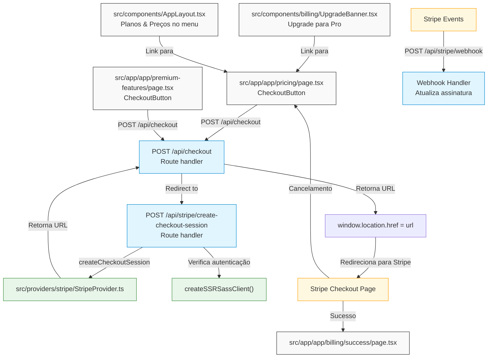

# Stripe Flow

## Pontos de origem do checkout:
- CheckoutButton no componente src/app/app/pricing/page.tsx - Página principal de preços
- CheckoutButton no componente src/app/app/premium-features/page.tsx - Página de recursos premium
- Links de upgrade em src/components/billing/UpgradeBanner.tsx - Banner de upgrade usado em várias partes do aplicativo
- Link de upgrade na barra lateral em src/components/AppLayout.tsx - Menu lateral com link para página de preços

## Fluxo da API:
- /api/checkout - Endpoint que recebe a solicitação inicial
- /api/stripe/create-checkout-session - Endpoint que cria a sessão de checkout do Stripe

## Redirecionamentos:
- Redirecionamento para a página de checkout do Stripe
- Redirecionamento para /app/billing/success em caso de sucesso
- Redirecionamento para /app/pricing em caso de cancelamento

