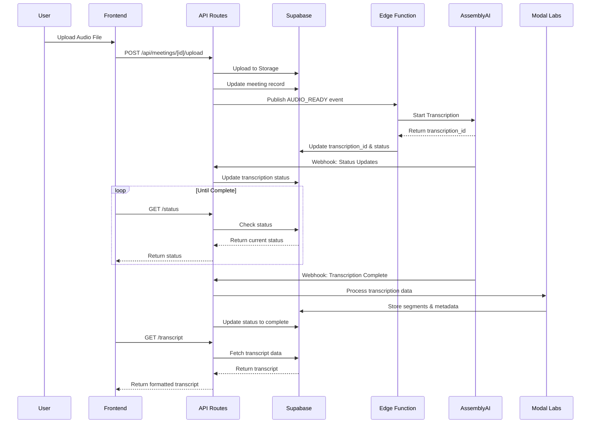
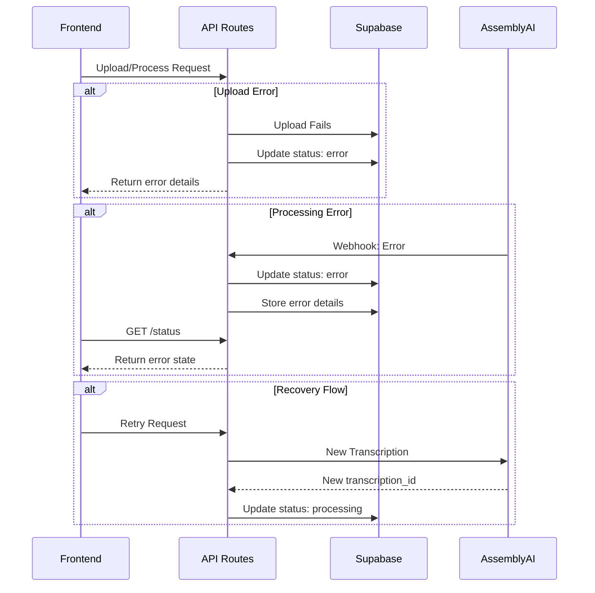
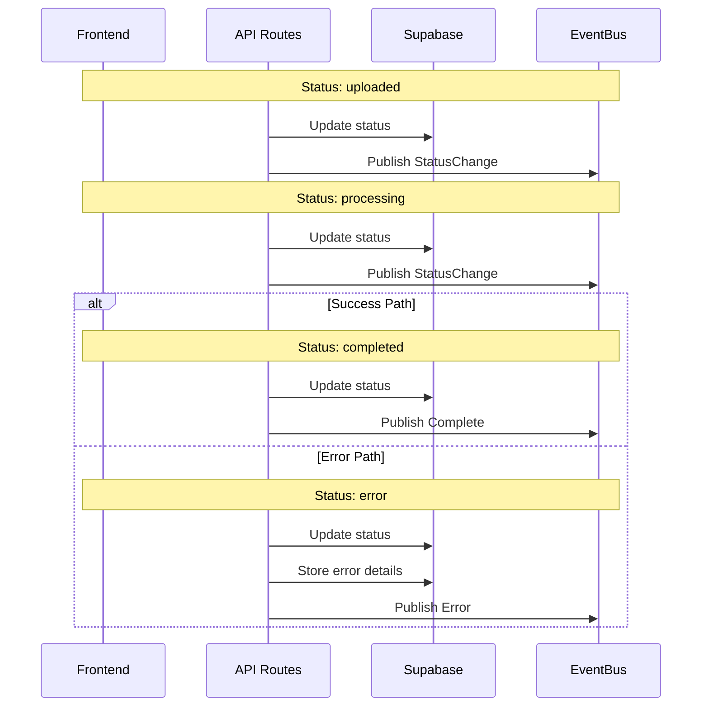
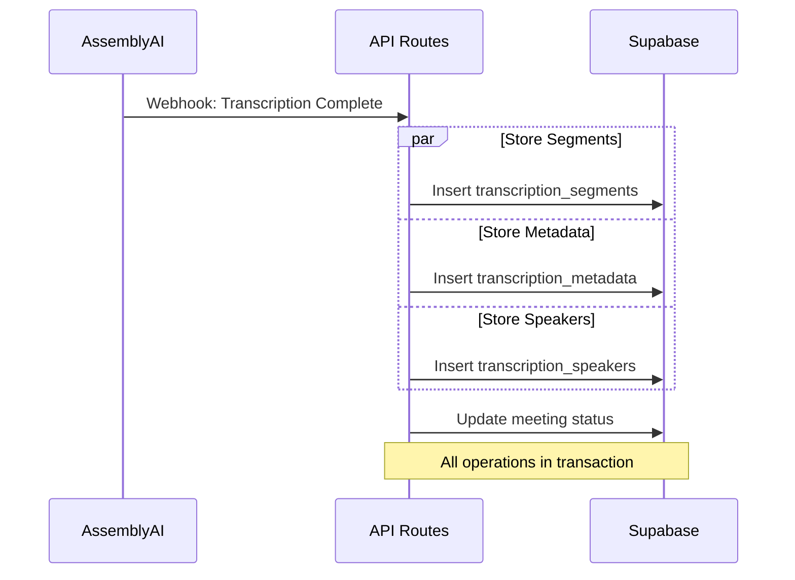

# Transcription System Sequence Diagrams

## Audio Upload and Transcription Flow

## Error Handling Flow

## Status Management Flow

## Data Storage Flow

## Implementation Notes

### Status Transitions
- `uploaded` → Initial state after file upload
- `processing` → Transcription in progress
- `completed` → Successfully processed
- `error` → Failed processing

### Error Handling Strategy
1. **Upload Errors**
   - Storage errors
   - File format issues
   - Size limitations

2. **Processing Errors**
   - Transcription service failures
   - Invalid audio format
   - Language detection issues

3. **Storage Errors**
   - Database constraints
   - Transaction failures
   - Concurrent updates

### Recovery Mechanisms
1. **Automatic Retry**
   - For transient failures
   - Configurable retry count
   - Exponential backoff

2. **Manual Retry**
   - User-initiated
   - Fresh transcription ID
   - Clear error state

### Data Integrity
1. **Transactions**
   - Atomic operations
   - Consistent state
   - Rollback on failure

2. **Validation**
   - Schema validation
   - Status transitions
   - Data constraints 